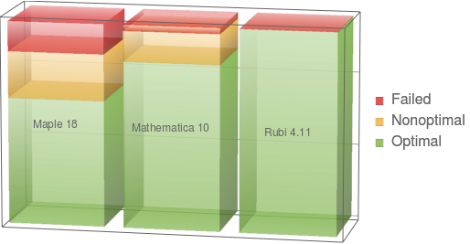

## Welcome to Rubi, the page for Rule-based Integration

Rubi is an extensive system of symbolic integration rules that can be systematically applied to determine the antiderivative of a wide variety of mathematical expressions. Organized as a decision tree based on the form of the integrand, the 6600+ rules Rubi uses can be viewed in human-readable form or downloaded in machine-readable form. 

## How Rubi Compares with Other Symbolic Integrators

Rubi dramatically out-performs Maple and Mathematica (the two major commercial computer algebra systems) on a grueling integration test suite consisting of over 70 thousand integrands and optimal antiderivatives. What constitutes an optimal antiderivative is defined following the table below. This chart shows the percentage of test suite problems for which these systems were able to find optimal antiderivatives.

{:refdef: style="text-align: center;"}

{:refdef}

