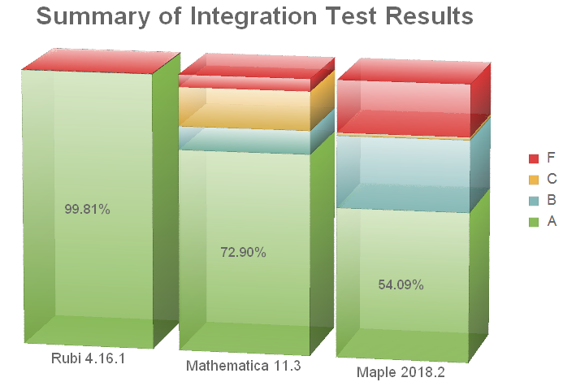

# Welcome to Rubi, the Rule-based Integrator

By systematically applying its extensive, coherent collection of symbolic integration rules, Rubi is able to find the optimal antiderivative of large classes of mathematical expressions. Also Rubi can show the rules and intermediate steps it uses to integrate an expression, making the system a great tool for both learning and doing mathematics.

The over 6700 rules Rubi uses are organized as a decision tree based on the form of the integrand. Click on [Rules](https://rulebasedintegration.org/integrationRules.html) to view the mathematical formula and application conditions for each rule expressed in standard 2-D mathematical notation.

If the Mathematica computer algebra system is available on your computer, click on [Install Rubi](https://rulebasedintegration.org/downloadRubi.html) for instructions how to download and install the system. Then click on [Using Rubi](https://rulebasedintegration.org/usingRubi.html) to learn how to integrate expressions and optionally show the steps required to do so.

An extensive test-suite of over 72,000 integration problems is used to test each new release of Rubi. Since it can also be used to test other symbolic integrators, the test-suite has been translated into the syntax of several popular computer algebra systems. Click on [Test Problem](https://rulebasedintegration.org/testProblems.html) to download the available translations of the test-suite. Click on [Test Results](https://rulebasedintegration.org/testResults.html) to view the very illuminating results of running the test-suite on Rubi and on Mathematica's built-in integrator.

Click on [Vision](https://rulebasedintegration.org/vision.html) to read a short, plain-language essay describing the numerous advantages of organizing mathematical knowledge as a rule-based decision tree like Rubi does. Finally, click on [About](https://rulebasedintegration.org/about.html) to read about Rubi's development and developers.


## Comparison with other symbolic integrators

Rubi dramatically out-performs other symbolic integrators, including Maple and Mathematica, on a grueling test-suite of integration problems. Each problem consists of an integrand and its optimal antiderivative. For each problem the result produced by a system is given a grade as follows:

- **A** - if the result is no more than twice the size of the optimal antiderivative *and* involves functions no higher-level than those in the optimal antiderivative.
- **B** - if the result is more than twice the size of the optimal antiderivative.
- **C** - if the result unnecessarily involves higher-level functions or complex numbers. For example, the result involves special functions, but the optimal antiderivative only involves elementary ones.
- **F** - if the result involves an integral, no result is produced within 120 seconds, or the system hangs or crashes.

The following chart summarizes the grades recent versions of Rubi, Mathematica and Maple made on the integration test-suite:

{:refdef: style="text-align: center;"}

{:refdef}

Click on the [Test Results](https://rulebasedintegration.org/testResults.html) menu option to see the detailed test results on which these bar charts are based. 

Also, Nasser M. Abbasi has done extensive testing of the integration capabilities on these and several other computer algebra systems. Detailed test results are available at his [Computer algebra independent integration tests](https://www.12000.org/my_notes/CAS_integration_tests/reports/rubi_4_15_2/) website. 


## Articles referencing rule-based integration

If you used Rubi in your work and want to cite it appropriately, please refer to the article [published in the Journal of Open Source Software](https://doi.org/10.21105/joss.01073). For BibTeX, you can use the following entry:

```bibtex
@article{Rich2018,
  title = {Rule-based integration: An extensive system of symbolic integration rules},
  author = {Albert Rich and Patrick Scheibe and Nasser Abbasi},
  doi = {10.21105/joss.01073},
  date  = {2018-12},
  publisher = {The Open Journal},
  volume = {3},
  number = {32},
  pages = {1073},
  journal = {Journal of Open Source Software}
}
```

Additionally, there are several articles and online posts about Rubi. Below, you find a selection:

- Albert Rich, Patrick Scheibe, and Nasser Abbasi (2018). [Rule-based integration: An extensive system of symbolic integration rules.](https://doi.org/10.21105/joss.01073) Journal of Open Source Software. 3.32, p1073 1-3, DOI: 10.21105/joss.

- Alexes Mes and Jed Stephens (2018). [An Application of Rubi: Series Expansion of the Quark Mass Renormalization Group Equation.](https://arxiv.org/abs/1811.04892) arXiv:1811.04892.

- Patrick Scheibe (2018). [Rubi - The Rule-based Integrator for Mathematica.](https://community.wolfram.com/groups/-/m/t/1421180) Wolfram Community post 1421180.

- Patrick Scheibe (2018). [Rubi - A Rule-based Integrator for Mathematical Expressions.](http://halirutan.de/programming/Rubi/) Blog post.

- David Jeffrey and Albert D. Rich (2016). [Developments in Rubi: Rule-based integration.]( https://www.unirioja.es/dptos/dmc/EACA2016/talks/Jeffrey.pdf) Presentation.

- David J. Jeffrey, Albert D. Rich, and Junrui Hu (2015). [Rubi and integration as term re-writing.](https://www.researchgate.net/publication/277344311_RUBI_and_integration_as_term_re-writing) ACM Communications in Computer Algebra. 49. 34-34. 10.1145/2768577.2768649.

- Albert D. Rich and David J. Jeffrey (2010). [Reducing expression size using rule-based integration.](http://www.apmaths.uwo.ca/~djeffrey/Offprints/Calc2010final.pdf) Intelligent Computer Mathematics. Ed: S.Autexier, J.Calmet, D. Delahaye, P.D.F.Ion, L.Rideau, R.Rioboo, A.P.Sexton. LNAI 6167, pp234-246, Springer.

- Albert D. Rich and David J. Jeffrey (2009). [A knowledge repository for indefinite integration based on transformation rules.](http://www.apmaths.uwo.ca/~djeffrey/Offprints/IntegrationRules.pdf) Intelligent Computer Mathematics, LNCS 5625, pp480-485, Springer.


## Rule-based integration resources

* To discuss issues related to rule-based integration, you are welcome to join Rubi's chatroom on Gitter at [https://gitter.im/Rule-Based-Integration/Lobby](https://gitter.im/Rule-Based-Integration/Lobby) using your GitHub login.

* To report bugs, request features or suggest new integration rules, please open an issue on GitHub at [https://github.com/RuleBasedIntegration/Rubi/issues](https://github.com/RuleBasedIntegration/Rubi/issues) and describe as clearly as possible the bug, request or suggestion.

* Rubi is a freely available system of integration rules.  The complete source code is available as Mathematica notebook files on GitHub at [https://github.com/RuleBasedIntegration/Rubi](https://github.com/RuleBasedIntegration/Rubi).  The notebooks contain the integration rules in both human and machine-readable form, and everything required to build and use it as Mathematica package.

* Rubi's Wiki-page at [https://github.com/RuleBasedIntegration/Rubi/wiki](https://github.com/RuleBasedIntegration/Rubi/wiki) is intended to contain detailed information about Rubi's development process.
